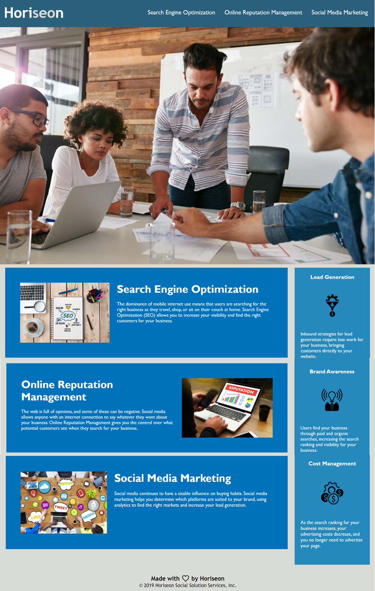

# Horiseon-Marketing

Overview:

A vital aspect, requiring careful consideration for many businesses today, is web accessibility. A properly designed and coded website will successfully allow people with disabilities to access a website using assistive technologies like video captions, screen readers, and braille keyboards.

Tim Berners-Lee, inventor of the World Wide Web, states that "The power of the Web is in its universality.
Access by everyone regardless of disability is an essential aspect.". Thus, it would not be an exaggeration to state that a fundamental part of web development is web accessibility.

However, there are still many websites that are developed with accessibility barriers that make them difficult or impossible for some people to use. One such example is my current client's web application. The underlying code for their website could be considered ranking low in accessibility standards. 

In order to improve this, I have refactored the code to include various HTML semantic elements. I have coded these elements to follow a logical structure independent of styling and position. Additionally, I have included accessible alt attributes to the icon and image elements and made certain that the header elements fall in a sequential order. Finally, I have included a title element with a concise description. 

Link:
